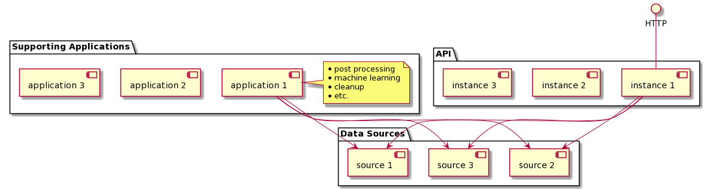
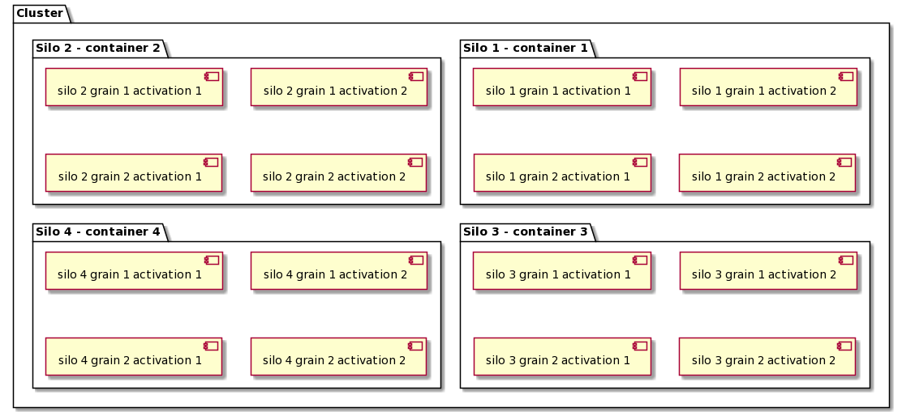
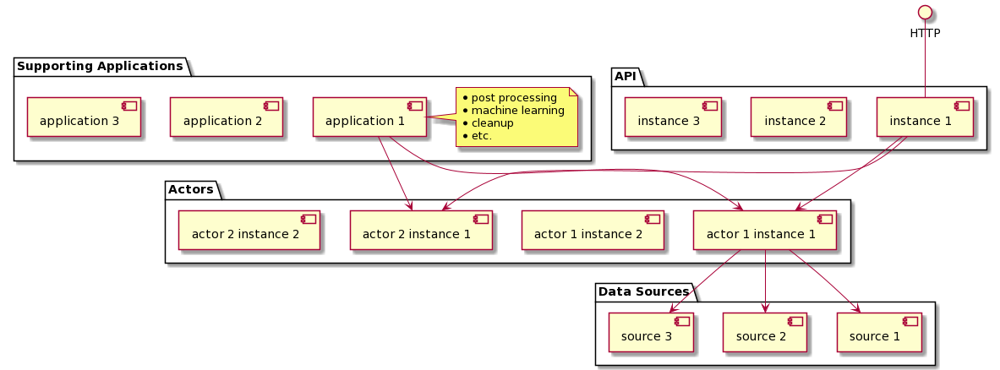

- [Cutting the distributed Gordian Knot with Virtual Actors - throughput and latency improvements with Orleans](#cutting-the-distributed-gordian-knot-with-virtual-actors---throughput-and-latency-improvements-with-orleans)
  - [distributed systems](#distributed-systems)
  - [traditional 3-tier microservices and their challenges](#traditional-3-tier-microservices-and-their-challenges)
  - [actors](#actors)
  - [virtual actors](#virtual-actors)
  - [virtual actors in distributed stateless and stateful applications](#virtual-actors-in-distributed-stateless-and-stateful-applications)
  - [examples](#examples)
    - [theoretical example 1](#theoretical-example-1)
      - [scenario](#scenario)
    - [theoretical example 2](#theoretical-example-2)
      - [scenario](#scenario-1)
  - [references](#references)
    - [1 - Distributed systems: principles and paradigms.](#1---distributed-systems-principles-and-paradigms)
    - [2 - A Universal Modular Actor Formalism for Artificial Intelligence](#2---a-universal-modular-actor-formalism-for-artificial-intelligence)
    - [3 - Pattern: Microservice Architecture](#3---pattern-microservice-architecture)
    - [4 - Actors for High-Scale Services](#4---actors-for-high-scale-services)
    - [5 - Project Orleans: Distributed Virtual Actors for Programmability and Scalability](#5---project-orleans-distributed-virtual-actors-for-programmability-and-scalability)
    - [6 - Orleans – Virtual Actors](#6---orleans--virtual-actors)
    - [7 - Orleans: Distributed Virtual Actors for Programmability and Scalability](#7---orleans-distributed-virtual-actors-for-programmability-and-scalability)
    - [8 - Microservices, Apache Kafka, and Domain-Driven Design](#8---microservices-apache-kafka-and-domain-driven-design)
  - [additional resources](#additional-resources)

# Cutting the distributed Gordian Knot with Virtual Actors - throughput and latency improvements with Orleans

This document outlines the purpose and the application of the Virtual Actor Model in modern distributed systems using Microsoft Orleans.

## distributed systems

*A distributed system is a system whose components are located on different networked computers, which communicate and coordinate their actions by passing messages to one another from any system.*[[1]](#1---distributed-systems-principles-and-paradigms)

A good example of a distributed system is a group of containerised:

* web APIs - placed behind a load balancer and serving customer traffic
* supporting applications - post processing, machine learning, cleanup, etc.

where applications communicate with a group of data sources and with each other via message queues or direct messages, perform business decisions, report on their health, etc.

## traditional 3-tier microservices and their challenges

Microservices are often characterised by:

* their lack of internal state
* application instances being expendable (mainly due to their stateless nature) - relatively simple to spin up and to tear down

which makes it fair to categorise traditional, 3-tier microservices as distributed stateless applications.

While microservices allow engineers to easily scale distributed systems both horizontally and vertically, they also present a number of challenges which become especially apparent when mission-critical speed is essential, namely:

* **scaling** - the ability to correctly respond to sudden changes in traffic volumes (it is not uncommon to see 10x+ traffic spikes in any Web API). Application instances should be quick to provision, wake up, warm up and start working with load balancers in order to serve traffic.
* **request processing speed** - the API should ideally be able to perform its tasks in predictable, relatively constant time.
* **performance bottlenecks** - if the application has a performance bottleneck (e.g. one task requiring excesive amounts of resources), scaling the application horizontally will just replicate those performance bottlenecks across the fleet of application instances.
* **implementation speed** - new features, deployment, maintenance, complexity off inter-service communication and testing. [[3]](#3---pattern-microservice-architecture)
* **storage** - it is often a bottleneck, efficient data shipping becomes a problem.[[4]]((#4---actors-for-high-scale-services))

In simplest terms, 3-tier microservices can be illustrated with the following diagram:

Fore the sake of clarity, only one component from each group (instance 1, application 1) has visible connections to other groups.

## actors

*The Actor Model is a mathematical theory of computation that treats “Actors” as the universal primitives of concurrent digital computation*[[2]](#2---a-universal-modular-actor-formalism-for-artificial-intelligence). The model has been used both as a framework for a theoretical understanding of concurrency, and as the theoretical basis for several practical implementations of concurrent systems. Recently, the Actor Model gained new popularity with the advent of cloud-based computing where:

* massive, distributed parallelism
* ability to quickly analyse and understand distributed systems by humans

are of critical importance.

In the simplest terms, Actors are characterised by three features:

* they are compact, very limited in scope, independent programs which can but don't have to hold internal state
* they don't share state - each actor is an independent entity with its own memory
* they only communicate indirectly via messages allowing for greater decoupling

Using the Actor Model in distributed systems allows for breaking down:

* complex
* resource-intensive

problems into parallel, more manageable, focused fragments which are shared between the components of a distributed system.

Popular languages adopting the Actor Models include:

* Erlang
* Elixir
* Scala
* P#, later Coyote
* Dart

## virtual actors

With Project Orleans, the term "virtual actor" is introduced[[6]](#6---orleans--virtual-actors):

*Virtual Actor - adaptation of the Actor Model for challenges of the Cloud.*[[5]](#5---project-orleans-distributed-virtual-actors-for-programmability-and-scalability)

This high level description translates into an improved version of the Actor Model characterised by four features[[7]](#7---orleans-distributed-virtual-actors-for-programmability-and-scalability):

1. **Perpetual existence** - actors are  purely  logical entities  that always exist,  virtually. An  actor cannot  be explicitly created or destroyed and its virtual existence is unaffected by the failure of a server that executes it. Since actors always exist, they are always addressable.
2. **Automatic instantiation**: Orleans’ runtime automatically creates in-memory instances of an actor called activations.
3. **Location transparency**: an actor may be instantiated in different locations at different times, and sometimes might not have a physical location at all.
4. **Automatic scale out**: currently, Orleans supports two activation modes for actor types: single  activation mode (default), in which only one simultaneous activation of an actor is allowed, and stateless worker mode, in which many independent activations of an actorare created automatically by Orleans on-demand (up to a limit) to increase throughput.

In short: *Project “Orleans” is a programming model and runtime for building cloud native services.*[[5]](#5---project-orleans-distributed-virtual-actors-for-programmability-and-scalability)

Orleans-specific terminology:

* **grain** - Virtual Actor (implemented as a .NET class)
* **activation** - instace of a grain (in the OOP terms, if grains are classes, activations are their objects)
* **silo** - actor host (implemented as a .NET process, optionally hosted in a container)
* **cluster** - group of silos working together and sharing grain activations (implemented as a group of e.g. containers). Orleans cluster is only a logical grouping (cluster membership is tracked either in silos' memory or in persistent storage like DynamoDB).

Orleans cluster can be illustrated as the following group of components working together:

However, in reality, we can have hundreds of silos participating in each cluster and hundreds of thousands of grain activations participating in every silo.

## virtual actors in distributed stateless and stateful applications

Now that all technologies are introduced, we can focus on the application of Virtual Actors in modern distributed systems.

What is proposed is to logically divide components of a distributed application into two categories:

* I/O operations - any database, service calls introducing uncertainty (latency, failure, etc.)
* state and pure (no side effects) state manipulations: mapping, filtering, business decisions, etc.

Once such division is made, groups of components will naturally emerge forming, what will be from now called, *modules*. Such *modules* can be delegated to be executed Virtual Actors for a minor network latency penalty.

**Example**:

A Web API, while processing a customer request, concurrently calls:

* data source 1
* data source 2
* data source 3

then, it awaits all three calls to finish, maps the results and proceeds with more calls to other data sources.

From this, we see that the API performs 5 operations:

* 3x I/O - for the sake of the example, it is assumed that each I/O call requires 3 awaitable tasks (or promises, depending on the language used)
  * 1 awaited task to obtain data source client
  * 1 awaited task to make the call
  * 1 awaited task to read the results of the call
* 1x additional I/O awaited task to wait for the results of the data source calls
* 1x pure state manipulation - just mapping, so no awaitable task required, this operation can be synchronous

That group of 5 operations naturally forms a *module* which, since it does not interact with Web API's internal state, can technically be executed by an external process, *outside* the API.

In such simple scenario, if we delegated the entire *module* to be executed by a Virtual Actor, we would have:

* saved the API 3 * 3 + 1 = 10 tasks

sacrificing:

* one task needed to communicate with the Virtual Actor
* single digit network latency (measured in millliseconds)

As a result, the API could spend those 9 leftover tasks on serving more customer requests plus benefit from multiple improvements which will be listed below.

Traditionally, designers would group such modules into a more coherent union, like e.g. Bounded Context [[8]](#8---microservices-apache-kafka-and-domain-driven-design) and place such union in an independent service. With the advent of Virtual Actors, we have dramatically more liberty when it comes to granular division of tasks which do not necessarily have to form a separate service or a Bounded Context.

In addition to the sheer savings in awaited tasks (which leads to improved overall throughput):

* API tasks are more operationally focused on what they should be most focused: on handling customer requests.
* The distributed system as a whole benefits from more granular horizontal scalability: both the API and the Virtual Actors are now more granular, easier to instantiate and manage.
* Virtual Actors can, but don't have to, be stateful which unlocks their potential for caching and serving the data to the callers without interacting with underlying data sources. Data storage and transit becomes much less of a problem in busy services.
* All systems become much easier to reason about and their hosting does no longer depend on having a independendly deployed services (Orleans Silos scale quickly and automatically).
* Code becomes very reusable (clear division between I/O and pure operations) since.
* Cost - smaller, more granular modules can be hosted on less powerful machines. This translates to either less demanding hosting infrastructure or more containers per host.
* The bird's eye view of the system is that it really is just one application (supporting applications can also use Virtual Actors). Behind the scenes, it's a distributed groupd of runtimes working together. This dramatically helps with code maintenance.
* Fast deployments (heterogenous silos), fast scaling (no warmup, internal load balancing and infrastructure state management), infrastructure and hosting is no longer coupled so tightly with the code itself.
* Limited blast radius - if there are problems with one *module* and it shuts down, it does not mean that the customer request or the calling API itself will be terminated. Aditionally, *modules* are by their nature call hedging friendly as grains are cheap to instantiate.
* Grains can be reused for better memory management.
* Traditional, Bounded Context centric, approach to service division can also be achieved by using a combination of heterogenous (mixed types of grains) and homogenous (one type of grain).

To sum up, dividing the work into I/O and pure operations, and subsequently into *modules* operated by Orleans Virtual Actors can give distributed systems a tremendous performance and throughput boost. It also significantly improves engineers' ability to actually understand and reason about the systems.

In simplest terms, microservices working with Virtual Actors can be illustrated with the following diagram:

Fore the sake of clarity, only one component from each group (instance 1, application 1, actor 1 instance 1) have visible connections to other groups.

## examples

### theoretical example 1

#### scenario

A Web API consists of 10 *modules*. *Modules* 1, 2, 3, 4, 5, 6, 10 are executed in sequence while *modules* 7, 8, 9 are executed concurrently and their results are only needed in *module* 10.

If each *module* requires 10 awaited tasks, delegating 3 *modules* to be executed by a Virtual Actor, helps the Web API reduce the number of tasks used:

* from 100
* to 71 (one task needed to communicate with the Virtual Actor)

which helps it improve its throughput for a minor network latency penalty (single digits, measured in milliseconds).

| current state | proposed changes |
| --- | --- |
|  |  |

### theoretical example 2

#### scenario

In this slightly more involved example, a Web API also consists of 10 *modules*. We see that *modules* 2, 3, 4, and 6, 7, 8 can be grouped into two Virtual Actors and executed there concurrently.

If each *module* requires 10 awaited tasks, delegating 6 *modules* to be executed by a Virtual Actor, helps the Web API reduce the number of tasks used:

* from 100
* to 42 (one task needed to communicate with each Virtual Actor)

which helps it improve its throughput for a minor network latency penalty (single digits, measured in milliseconds). Where critical performance is required, call hedging can be easily implemented as instantiating Virtual Actors is cheap and fast.

| current state | proposed changes |
| --- | ---|
|  | |

## references

### 1 - Distributed systems: principles and paradigms.

Tanenbaum, Andrew S.; Steen, Maarten van (2002). Distributed systems: principles and paradigms. Upper Saddle River, NJ: Pearson Prentice Hall. ISBN 0-13-088893-1.

### 2 - A Universal Modular Actor Formalism for Artificial Intelligence

Hewitt, Carl; Bishop, Peter; Steiger, Richard (1973). "A Universal Modular Actor Formalism for Artificial Intelligence". IJCAI.

### 3 - Pattern: Microservice Architecture

https://microservices.io/patterns/microservices.html

### 4 - Actors for High-Scale Services

http://www.hpts.ws/papers/2013/Bykov.pdf

### 5 - Project Orleans: Distributed Virtual Actors for Programmability and Scalability

https://www.microsoft.com/en-us/research/uploads/prod/2016/02/philbe-disckeyotephilbefinal.pdf

### 6 - Orleans – Virtual Actors

https://www.microsoft.com/en-us/research/project/orleans-virtual-actors/?from=http%3A%2F%2Fresearch.microsoft.com%2Fprojects%2Forleans%2F

### 7 - Orleans: Distributed Virtual Actors for Programmability and Scalability

https://www.microsoft.com/en-us/research/wp-content/uploads/2016/02/Orleans-MSR-TR-2014-41.pdf

### 8 - Microservices, Apache Kafka, and Domain-Driven Design

https://www.confluent.io/blog/microservices-apache-kafka-domain-driven-design/

## additional resources

* Orleans source code: https://github.com/dotnet/orleans
* Orleans documentation: https://dotnet.github.io/orleans/
* Coyote source code: https://github.com/microsoft/coyote/
* Actor Model of Computation: Scalable Robust Information Systems: https://arxiv.org/ftp/arxiv/papers/1008/1008.1459.pdf
* Orleans best practices: https://www.microsoft.com/en-us/research/wp-content/uploads/2016/02/Orleans20Best20Practices.pdf
* Orleans Gitter: https://gitter.im/dotnet/orleans?at=5deaf4829319bb5190f24ffe
* Road to Orleans - a series of practical Orleans examples: https://github.com/PiotrJustyna/road-to-orleans