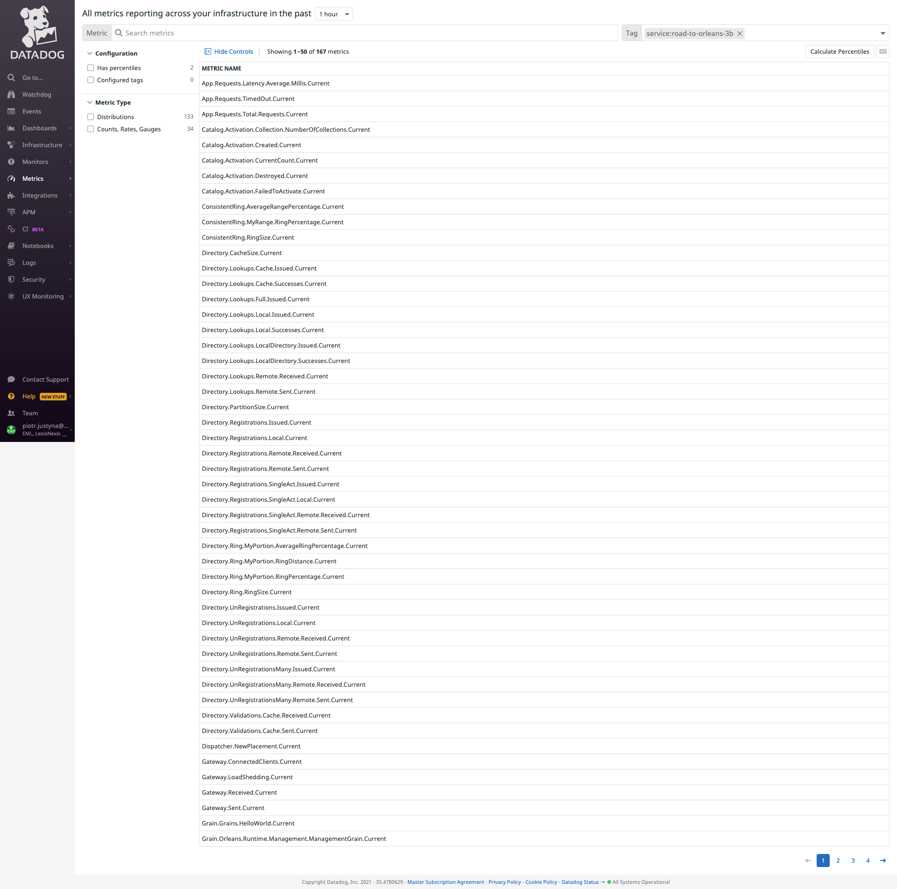
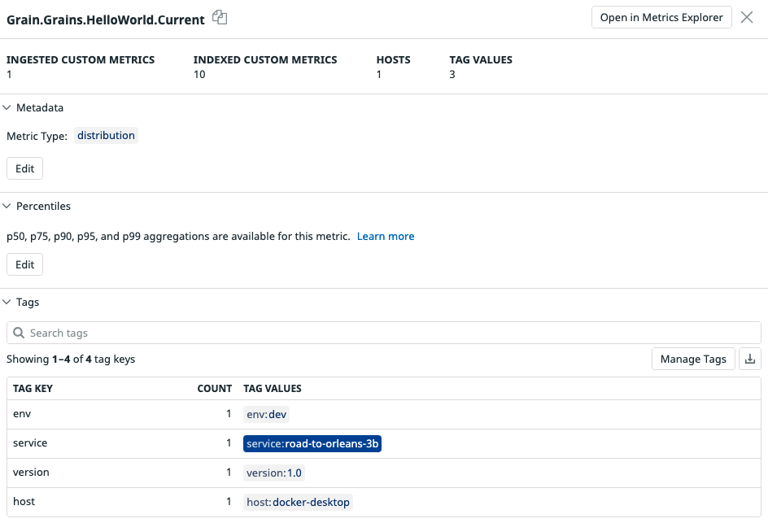
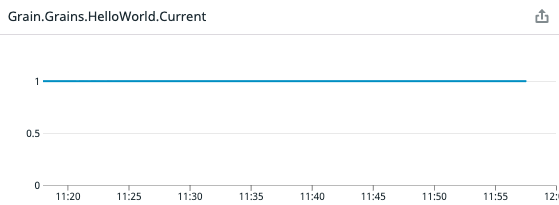
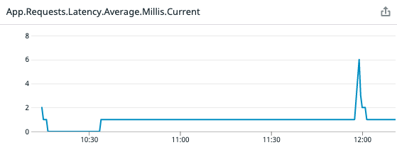
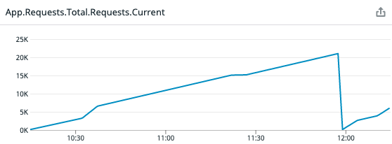
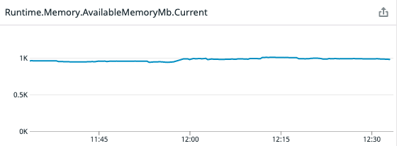
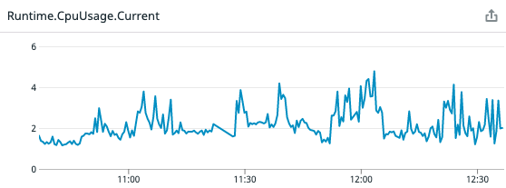
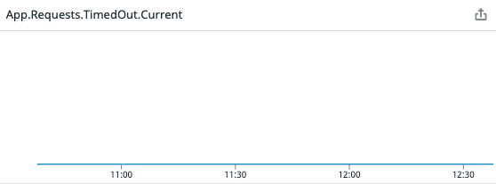

- [orleans application performance monitoring with datadog](#orleans-application-performance-monitoring-with-datadog)
  - [orleans](#orleans)
  - [datadog](#datadog)
  - [challenge](#challenge)
  - [solution](#solution)
    - [telemetry metric consumer](#telemetry-metric-consumer)
    - [local hosting and testing](#local-hosting-and-testing)
  - [sample metrics](#sample-metrics)

# orleans application performance monitoring with datadog

This article covers the challenge of leveraging datadog as an APM platform for orleans applications.

## orleans

Virtual actors framework for .NET. It's an extremely valuable tool for building distributed stateful and stateless systems leveraging the actor model. It's open source and can be found here: https://github.com/dotnet/orleans

## datadog

Application performance monitoring platform we use to monitor our .NET applications. It consists of two components

* tracer - a library running alongside the executable code, responsible for extracting runtime metrics of the monitored application.
* agent - a service running alongside the monitored application, accepting application metrics from the tracer. Once accepted, the metrics get propagated to datadog servers.

## challenge

Orleans is an evolving, relatively young framework which does not yet support all major APM platforms. It does support e.g. newrelic, but not datadog yet. In order to leverage datadog for orleans monitoring, two challenges need to be overcome:

* No official nuget package implementing `IMetricTelemetryConsumer` for datadog and orleans.
* Hosting a testing locally - in order to start sending metrics from an application running locally, one also needs to host the datadog agent accepting those metrics.

## solution

### telemetry metric consumer

A basic telemetry metric consumer, which simply propagates all unfiltered metrics to datadog needs to implement `IMetricTelemetryConsumer` interface. To supplement those metrics with other stats, following interfaces should ideally be implemented as well:

* `IEventTelemetryConsumer`
* `IExceptionTelemetryConsumer`
* `IDependencyTelemetryConsumer`
* `IRequestTelemetryConsumer`

But in our scenario, `IMetricTelemetryConsumer` is more than sufficient. As the code for such telemetry consumer is not available at the time of writing this, here is a sample template which can be used instead:

```csharp
public class DatadogTelemetryConsumer : IMetricTelemetryConsumer, IDisposable
{
    private readonly DogStatsdService _service;

    public DatadogTelemetryConsumer()
    {
        var statsdConfig = new StatsdConfig();

        _service = new DogStatsdService();
        _service.Configure(statsdConfig);
    }

    public void DecrementMetric(string name) => _service.Decrement(name);

    public void DecrementMetric(string name, double value) => _service.Decrement(name, Clamp(value));

    public void IncrementMetric(string name) => _service.Increment(name);

    public void IncrementMetric(string name, double value) => _service.Increment(name, Clamp(value));

    public void TrackMetric(string name, TimeSpan value, IDictionary<string, string> properties = null) =>
        _service.Distribution(name, value.TotalMilliseconds, tags: ToTags(properties));

    public void TrackMetric(string name, double value, IDictionary<string, string> properties = null) =>
        _service.Distribution(name, value, tags: ToTags(properties));

    public void Flush() => _service.Flush();

    public void Close() => _service.Flush();

    public void Dispose() => _service.Dispose();

    private int Clamp(double value) => (int) Math.Clamp(value, int.MinValue, int.MaxValue);

    private string[] ToTags(IDictionary<string, string> properties) => properties?.Select(ToTag).ToArray();

    private static string ToTag(KeyValuePair<string, string> property) => $"{property.Key.Replace(':', '_')}:{property.Value.Replace(':', '_')}";
}
```

### local hosting and testing

For the sake of simplicity, only docker hosting is covered in this article. The steps for hosting directly on physical machines can be derived from the docker procedure.

In order to start sending application metrics to datadog, two things are required:

* tracer - https://github.com/DataDog/dd-trace-dotnet
  * to be placed in `/opt/datadog` of the docker image hosting the orleans application
  * `createLogPath.sh` (provided with the tracer) to be executed from `/opt/datadog`
  
  For simplicity, these lines can be added for one's orleans silo host dockerfile (if pulling the tracer directly from github at image build time is not a concern, and it should be for production applications):

  ```bash
    RUN mkdir /opt/datadog
    ADD https://github.com/DataDog/dd-trace-dotnet/releases/download/v1.27.0/datadog-dotnet-apm-1.27.0-musl.tar.gz /opt/datadog
    RUN cd /opt/datadog && gzip -d ./datadog-dotnet-apm-1.27.0-musl.tar.gz  && tar xf ./datadog-dotnet-apm-1.27.0-musl.tar
    RUN cd /opt/datadog && sh createLogPath.sh
  ```

  At the time of writing this, the last version is `1.27.0`.

* datadog agent - this part is much simpler and it's just a correctly configured container started from an image provided by datadog.
  * image: 
  * configuration:

For the sake of completeness, below is a `docker-compose.yml` file starting

* a datadog agent container
* and a container hosting orleans and a datadog tracer for it

```yml
version: "3"

networks:
  hostnet:

services:
  datadog-agent:
    image: gcr.io/datadoghq/agent:latest
    networks:
      - hostnet
    environment:
      - DD_API_KEY=${DATADOG_API_KEY}
      - DD_APM_ENABLED=true
      - DD_APM_NON_LOCAL_TRAFFIC=true
      - DD_DOGSTATSD_NON_LOCAL_TRAFFIC=true
    volumes:
      - /var/run/docker.sock:/var/run/docker.sock:ro
      - /proc/:/host/proc/:ro
      - /sys/fs/cgroup/:/host/sys/fs/cgroup:ro

  silo-host:
    image: silo-host
    links:
      - datadog-agent
    networks:
      - hostnet
    ports:
      - ${DASHBOARDPORT}:${DASHBOARDPORT}
      - ${GATEWAYPORT}:${GATEWAYPORT}
    environment:
      - CORECLR_ENABLE_PROFILING=1
      - CORECLR_PROFILER={846F5F1C-F9AE-4B07-969E-05C26BC060D8}
      - CORECLR_PROFILER_PATH=/opt/datadog/Datadog.Trace.ClrProfiler.Native.so
      - DD_INTEGRATIONS=/opt/datadog/integrations.json
      - DD_DOTNET_TRACER_HOME=/opt/datadog
      - DD_LOGS_INJECTION=true
      - DD_TRACE_SAMPLE_RATE=1
      - DD_RUNTIME_METRICS_ENABLED=true
      - DD_AGENT_HOST=datadog-agent
      - DD_VERSION=1.0
      - DD_SERVICE=${DATADOG_SERVICE_NAME}
      - DD_ENV=${DATADOG_ENVIRONMENT}
      - ADVERTISEDIP=${ADVERTISEDIP}
      - GATEWAYPORT=${GATEWAYPORT}
      - DASHBOARDPORT=${DASHBOARDPORT}
```

All application-specific values are provided to the docker-compose file through an environment variables file.

## sample metrics

Once the docker-compose file is executed and orleans clients start generating application traffic, metrics start appearing in datadog. We can see that orleans telemetry helps shed light on application usage, latencies and resource consumption.

There are 167 metrics the telemetry consumer exposes:



They are all correctly tagged:



Captured metrics help us formulate good understanding of what our orleans application is doing and what the resource consumption is. To list some of the most useful metrics:

|||
| --- | --- |
| `Grain.Grains.HelloWorld.Current` - number of `HelloWorld` grain. In our case it's an uneventful one grain.  | `App.Requests.Latency.Average.Millis.Current` - average application latency.  |
| `App.Requests.Total.Requests.Current` - total number of requests an application receives. In this example the application was restarted which reset the counter to 0.  | `Runtime.Memory.AvailableMemoryMb.Current` - amount of available memory in Mb.  |
| `Runtime.CpuUsage.Current` - amount of CPU the runtime consumes.  | `App.Requests.TimedOut.Current` - number of timed out requests. Uneventful zero.  |