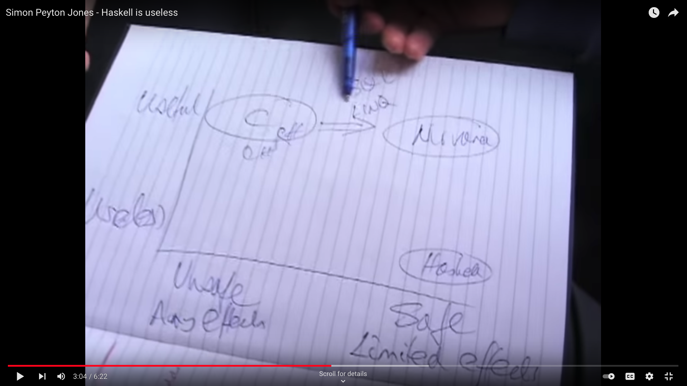

# selected 2021 email risk score ecosystem changes

---

## functional programming with f#

* pure code: map type A to type B, mathematical roots
* effectful code: call the database, write to file
* pure != functional
* effectful != functional

---

* functional = usually functions are treated as first-class citizens (but where are they not these days!)
  * is JS functional? Kind of.
  * is C#/Java functional? Kind of.
  * is F#/Scala functional? Yes, but also kind of.
  * is C functional? Well, it kind of also is.
  * is Haskell functional? Definitely yes. It is nothing if not functional.

* what is the goal vs how to achieve the goal

---

### why

Clearly convey intentions/meaning using reasonable numbers of lines of code.

---

[source](https://www.youtube.com/watch?v=iSmkqocn0oQ&t=12s)

---

* Fewer lines of explicit, clear code
    * easier, cheaper maintenance
      * more frequent iterations
        * shorter time to market

But ultimately: happier engineers.

---

### how

* pure and effectful concepts ideally should not mix unless it cannot be avoided
* that simple rule leads to very powerful results - it is significantly easier to:
  * infer meaning/intentions from the code
  * make testing trivial and enjoyable
  * know precisely where side effects take place, if they do happen

---

### f#

* latest major addition (albeit not recent) to the family of .NET languages
* it is more difficult to fall into traps traditionally associated with imperative programming (mutable global state, argument mutation, implicit effectfullness, etc.) when using F#. It seemed a natural choice.
* it is free of some of the imperative programming baggage that C# engineers need to be mindful of.

---

## orleans

---

### the actor model

In computer science it is a mathematical model of concurrent computation that treats actor as the universal primitive of concurrent computation.
  
In response to a message it receives, an actor can: make local decisions, create more actors, send more messages, and determine how to respond to the next message received. Actors may modify their own private state, but can only affect each other indirectly through messaging (removing the need for lock-based synchronization).

Think lambdas.

[source](https://en.wikipedia.org/wiki/Actor_model)

---

### the virtual actor model

* actors can be persisted in selected storage mechanism if not used, and summoned to life only when needed
* just like memory paging (primary vs secondary storage)
* that allows for massive numbers of actors coexisting and interacting with each other

Think stateful lambdas that can be persisted.

---

### why

The actor model is perfect in scenarios where massively concurrent (and optionally stateful) workloads span many hosts and need to be precisely coordinated.

Orleans gives us the virtual actor model capabilities out of the box + .NET + much more.

---

### common use cases

* distributed caching
* post processing and soft realtime scenarios
* massively distributed stateful/stateless systems
* fanout tasks spanning

---

### email risk score + orleans

Purely stateless usage as of today:

* distributed caching - redis on steroids: storage and computations (settings)
* post processing - email catalog, ns lookup saves
* soft realtime queries - settings
* timed execution of work (think cron + lambda) - email data source

---

## further reading

* [my github: https://github.com/PiotrJustyna](https://github.com/PiotrJustyna)
* [road to orleans: https://github.com/PiotrJustyna/road-to-orleans](https://github.com/PiotrJustyna/road-to-orleans)
* articles covering this direction:
  * [cutting the distributed gordian knot with virtual actors - throughput and
latency improvements with orleans](https://start.emailopen.com/publicfiles1/client_1048/files_cl1048_ca252004/Index_Piotr_Justyna.pdf)
  * [orleans application performance monitoring with
datadog](https://eo.lexisnexis.com/publicfiles1/client_1048/files_cl1048_ca271968/Orleans_-_application_performance_monitoring_with_.pdf)
  * [practical functional refactoring tips for the imperative
world](https://start.emailopen.com/publicfiles1/client_1048/files_cl1048_ca285179/practical_functional_refactoring_tips_for_the_impe.pdf)