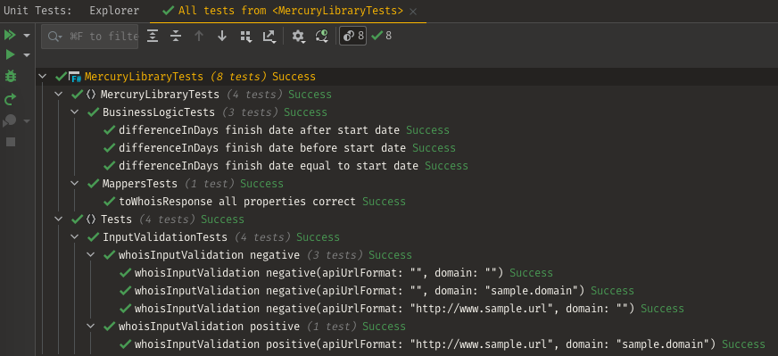

- [practical functional refactoring tips for the imperative world](#practical-functional-refactoring-tips-for-the-imperative-world)
  - [how did we get here](#how-did-we-get-here)
  - [terminology](#terminology)
  - [why functional programming](#why-functional-programming)
  - [refactoring workflow](#refactoring-workflow)
    - [step 1 - identify different code responsibilities](#step-1---identify-different-code-responsibilities)
    - [step 2 - categorize responsibilities: pure vs effectful](#step-2---categorize-responsibilities-pure-vs-effectful)
    - [step 3 - DTOs/models/value objects](#step-3---dtosmodelsvalue-objects)
    - [step 4 - isolate remaining pure responsibilities](#step-4---isolate-remaining-pure-responsibilities)
      - [input validation](#input-validation)
      - [business logic](#business-logic)
      - [mapping logic](#mapping-logic)
    - [step 5 - unit test](#step-5---unit-test)
  - [conclusion](#conclusion)
  - [2021-10-01 revision](#2021-10-01-revision)

# practical functional refactoring tips for the imperative world

This article covers a practical to follow refactoring workflow which helps transform difficult to manage legacy code into a more functional, easier to manage version of itself.

This article is also a good starting point for those wanting to experiment with adopting F# but are not sure where to start.

## how did we get here

For the most of 2020 the Emailage Dublin team was busy upgrading the Email Risk Score API:

* windows -> linux
* ec2 -> docker + ecs
* .net framework -> .net core and later to .net 5
* 1-2 releases per week -> many releases every day
* changes tracked but no ceremonies
* one branch
* no manual testing

All those changes helped us solve the hosting/frequent releases problem and gave us strong foundations for quick iterations with tight feedback loops.

We were careful not to affect the business logic though in any way during the upgrade. We quickly realized that while the code is working, does generate revenue and is used by many customers worldwide, it is very difficult to maintain and extend. Equipped with the new hosting strategy, the new framework and the tooling, we decided to tackle the unmaintainable post-startup/frantically-written-at-3-am-to-make-the-sale code in 2021. We also detected a number of performance bottlenecks for which we proposed the actor model. More on that in one of the previous articles [Cutting the distributed Gordian Knot with Virtual Actors - throughput and latency improvements with Orleans](https://github.com/PiotrJustyna/articles/blob/main/orleans/index.md). In order to easily adopt the model and in order to make the code easy to maintain going forward, we simply proposed to split the code into two categories: pure (business logic generally speaking) and effectful (usually I/O, asynchronous code).

As we started building the pure, reusable C# 9.0 library, we realized that the code feels very much like F# (immutable models, functional purity), so as a result we decided to use that language instead. Using F# it is also generally more difficult to fall into imperative programming traps that usually have long term side effects.

## terminology

* *pure code* - just as mathematical functions, however many times a function gets executed with the same input, it always returns the same output. Changes in external state do not affect how the function operates.
* *effectful (impure)* - everything that's not pure: reading from a file, communicating with a web service, even telling the time!
* *mutation* - process of changing something, usually global state or input function arguments. Usually not desired.
* *global state* - e.g. program-wide variables, database, everything that happens outside the function at hand
* *I/O* - input/output: database communication, reading from files, etc.
* *property based tests* - unit tests on steroids. Tested code is expected to have certain properties that hold true under heavy testing using usually random input. 
* *business logic (archaic term)* - the secret sauce: filters, decisions, control flows, etc.

## why functional programming

Among many others reasons which are not the focus of this article:

* **code != code**
  
  There's value in recognizing differences between effectful and pure code (side effects vs no side effects). What mature functional languages (e.g. Haskell, F#) propose is to embrace those very differences and make them explicit. Those differences are what the article recognizes as one of the most appealing features of functional programming.

* **composability**

  Working with a piece of pure code one can be sure that it is perfectly composable: global state is not accessed or mutated, variables - immutable, functions - self-contained. Chaining pure operations together is generally a very pleasant experience. On the other hand though, chaining effectful operations together is not as straightforward, but making the effectfullnes of the code explicit helps prepare for complications. In the world where pure and effectful pieces of code are mixed together, composition is usually not something that comes cheaply.

* **testability**

  Pure code is a joy to unit test. No dependency mocking or global state setup required. As a bonus, it is relatively easy to expose pure code to property based tests, etc.

## refactoring workflow

We are going to take a closer look at a legacy-style piece of code loosely based on an actual legacy class found in the Email Risk Score API. Let's call it Project Mercury.

Here is the legacy code: [https://github.com/PiotrJustyna/mercury-legacy](https://github.com/PiotrJustyna/mercury-legacy) We are specifically interested in file [Program.cs](https://github.com/PiotrJustyna/mercury-legacy/blob/main/MercuryLegacy/Program.cs) which is nearly 150 lines of code, no tests, but many responsibilities.

And here is the new, refactored version (careful, spoilers!): [https://github.com/PiotrJustyna/mercury-pure-functional](https://github.com/PiotrJustyna/mercury-pure-functional)

### step 1 - identify different code responsibilities

This should be a rather obvious step for SOLID practitioners. Some legacy code tends to mix various responsibilities. It is always a good idea to identify and separate them from each other.

In our case there are 4 responsibilities:

* input validation
* api call
* mapping
* business logic

### step 2 - categorize responsibilities: pure vs effectful

In our case the categorization is straightforward:

* input validation - it is relatively easy to categorize this responsibility as pure (the code executed many times consecutively with the same input always gives identical results), but there is more than meets the eye and it should be noted:
  
  * exception-throwing code is considered pure
  * *exception-catching* code is not considered pure ([source](https://stackoverflow.com/questions/12335245/why-is-catching-an-exception-non-pure-but-throwing-an-exception-is-pure))
  
  It is crucial to remember this while designing/refactoring code.

* api call - effectful
* mapping - pure
* business logic - pure

### step 3 - DTOs/models/value objects

Make the models immutable. In our case all pure code gets translated from C# to F#, so we are going to create some models in the `MercuryLibrary` project.

```f#
[<CLIMutable>]
type Audit =
    { createdDate: string
      updatedDate: string }

[<CLIMutable>]
type WhoisRecord =
    { createdDate: string
      updatedDate: string
      expiresDate: string
      status: string
      audit: Audit }

type WhoisResponse =
    { Domain: string
      DomainAgeInDays: int
      DomainLastUpdatedInDays: int
      DomainExpirationInDays: int
      AuditCreated: DateTime
      AuditUpdated: DateTime }
    override x.ToString() =
        $"\"{x.Domain}\": {x.DomainAgeInDays} days since domain creation, {x.DomainLastUpdatedInDays} days since domain last updated, {x.DomainExpirationInDays} until domain expires"
```

The code is also available here as a separate branch: [Step 3](https://github.com/PiotrJustyna/mercury-pure-functional/tree/Step3).

### step 4 - isolate remaining pure responsibilities

Move all pure responsibilities (in our case input validation, mapping and business logic) to pure, testable F# functions located in responsibility-specific modules. For the sake of simplicity, the article covers null-checking on the C# side so that it doesn't have to be done on the F# side where nulls are not a natural fit.

#### input validation

```fsharp
let whoisInputValidation (apiUrlFormat: string) (domain: string) =
    if String.IsNullOrWhiteSpace apiUrlFormat then raise (new ArgumentException(nameof(apiUrlFormat))) else ()
    if String.IsNullOrWhiteSpace domain then raise (new ArgumentException(nameof(domain))) else ()
```

#### business logic

```fsharp
let differenceInDays (start: DateTime) (finish: DateTime) = (finish - start).Days
```

#### mapping logic

```fsharp
let toWhoisResponse (domain: string) (whoisRecord: WhoisRecord) =
    let now = DateTime.UtcNow

    let createdDate =
        match DateTime.TryParse whoisRecord.createdDate with
        | _, date -> date

    let updatedDate =
        match DateTime.TryParse whoisRecord.updatedDate with
        | _, date -> date

    let expiresDate =
        match DateTime.TryParse whoisRecord.expiresDate with
        | _, date -> date

    let auditCreatedDate =
        match DateTime.TryParse whoisRecord.audit.createdDate with
        | _, date -> date

    let auditUpdatedDate =
        match DateTime.TryParse whoisRecord.audit.updatedDate with
        | _, date -> date

    { Domain = domain
      DomainAgeInDays = BusinessLogic.differenceInDays createdDate now
      DomainLastUpdatedInDays = BusinessLogic.differenceInDays updatedDate now
      DomainExpirationInDays = BusinessLogic.differenceInDays now expiresDate
      AuditCreated = auditCreatedDate
      AuditUpdated = auditUpdatedDate }
```

The code is also available here as a separate branch: [Step 4](https://github.com/PiotrJustyna/mercury-pure-functional/tree/Step4).

### step 5 - unit test

In our case, the legacy code did not have any unit tests, so new tests will be needed.

Most of our unit tests will reside alongside the F# code, but some (those involving null-checking) will be written in C# to save us some headache (again, null-checking is not an everyday thing in the F# world).

To unit test the C# null-checking code, we are going to make it public. If it was not a hello-world but actual, production-grade code we would still prefer making the functions public (but not disclosing them in any interface) rather than unit testing indirectly through their public callers for more straightforward testability. In our case there are no interfaces, hence the need for this comment.

For unit tests, we are going to use xunit as it is a mature product and it is supported by C# and F#. What is provided in terms of unit tests is just an idea of what and how can be tested and can be greatly expanded beyond the scope of this article.



The code is also available here as a separate branch: [Step 5](https://github.com/PiotrJustyna/mercury-pure-functional/tree/Step5).

It is not claimed that the code is perfect, but undoubtedly it is now much easier to test, reason about, maintain and support.

## conclusion

Before: [https://github.com/PiotrJustyna/mercury-legacy/blob/main/MercuryLegacy/Program.cs](https://github.com/PiotrJustyna/mercury-legacy/blob/main/MercuryLegacy/Program.cs)

After: [https://github.com/PiotrJustyna/mercury-pure-functional/blob/main/MercuryHost/Program.cs](https://github.com/PiotrJustyna/mercury-pure-functional/blob/main/MercuryHost/Program.cs)

Looking at the code side by side, responsibility of each function is immediately apparent. The starting block of code reduced in size by 50% and 75% of its starting responsibilities got migrated to testable functions. We started with no unit tests and ended up with a very respectable coverage that is easy to expand further.

Furthermore, and that is the key win of our proposed refactoring, it is guaranteed that all the code in the F# library is pure and can be composed with no preparations.

Finally, it is easy to confuse this advice with SOLID's "S", but the twist is just to focus on pure responsibilities. Refactoring effectful code will be covered in future articles.

## 2021-10-01 revision

I am grateful to have received some great feedback after publishing the article:

* [fsunit](https://fsprojects.github.io/FsUnit/) replaced with [unquote](https://github.com/SwensenSoftware/unquote) - more precise type checking, better messages

* simplified `ArgumentException`: https://docs.microsoft.com/en-us/dotnet/fsharp/language-reference/exception-handling/the-invalidarg-function
  * before: `raise (new ArgumentException(nameof(apiUrlFormat)))`
  * after: `invalidArg (nameof apiUrlFormat) ""`

* `if/then/else` simplified in case there's no `else`:
  * before: `if confition then A else ()`
  * before: `if confition then A`

* null checking on the C# side - this is slightly more involved and requires us to take a step back and revise what we know about F# types.
  * [Classes (F#)](https://docs.microsoft.com/en-us/dotnet/fsharp/language-reference/classes)
  * [Null Values](https://docs.microsoft.com/en-us/dotnet/fsharp/language-reference/values/null-values)
  * [AllowNullLiteralAttribute](https://fsharp.github.io/fsharp-core-docs/reference/fsharp-core-allownullliteralattribute.html#Value)